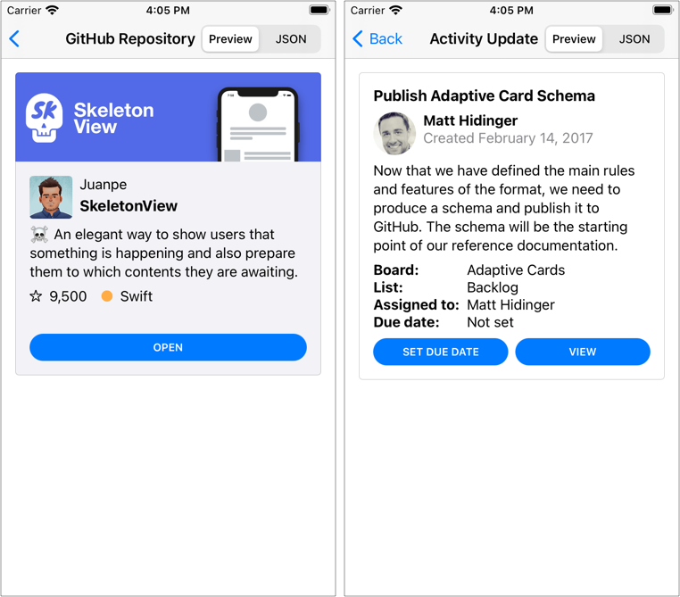

# AdaptiveCardUI
[](https://github.com/gonzalezreal/AdaptiveCardUI/actions?query=workflow%3ACI)


[](https://twitter.com/gonzalezreal)

AdaptiveCardUI is a library for rendering Adaptive Cards in SwiftUI.

Adaptive Cards are snippets of UI, authored in JSON, that apps and services can openly exchange. AdaptiveCardUI transforms this JSON into a native SwiftUI view tree, allowing the integration of lightweight UI into your SwiftUI app.

* [Motivation](#motivation)
* [Adaptive Card Basics](#adaptive-card-basics)
* [Displaying Adaptive Cards](#displaying-adaptive-cards)
* [Customizing Appearance](#customizing-appearance)
* [Adding Custom Elements](#adding-custom-elements)
* [Compatibility](#compatibility)
* [Installation](#installation)
* [Other Libraries](#other-libraries)

## Motivation
Microsoft builds and maintains the Adaptive Card schema. They have SDKs available for [several platforms](https://github.com/microsoft/AdaptiveCards), including a [UIKit Objective-C++ based implementation](https://github.com/microsoft/AdaptiveCards/tree/main/source/ios) for iOS.

AdaptiveCardUI aims to provide a more natural experience for Swift developers:
* It uses Swift `Codable` for decoding and encoding Adaptive Cards
* Allows appearance customization through view modifiers and the SwiftUI `Environment`
* Supports extensibility through Custom Elements
* Supports Dark Mode and Dynamic Type
* Works on all the platforms where SwiftUI is present

## Adaptive Card Basics
Adaptive Cards are a great way to display and interact with data, clearly and consistently. You can use them to display rich text alongside images, allow users to interact with buttons, or even collect form data.

Here is a simple card that includes a text, followed by an image and a button.

```json
{
  "type": "AdaptiveCard",
  "version": "1.3",
  "body": [
    {
      "type": "TextBlock",
      "text": "Here is very cute dog"
    },
    {
      "type": "Image",
      "url": "https://picsum.photos/id/237/300"
    }
  ],
  "actions": [
    {
      "type": "Action.OpenUrl",
      "url": "https://picsum.photos",
      "title": "Lorem Picsum Photos"
    }
  ]
}
```

The root object is the Adaptive Card itself and specifies the `version` required to display it. The `body` is composed of building blocks known as *elements*. You can arrange them in different ways to create many types of cards. Additionally, Adaptive Cards may include `actions` on which the user can act.

The most fundamental elements of an Adaptive Card are:
* `TextBlock` - a block of text and its appearance
* `RichTextBlock` - allows for inline text formatting
* `Image` - an image located in a URL and its appearance

Adaptive Cards can also have containers, which arrange a collection of child elements.
* `Container` - a collection of elements stacked vertically
* `ColumnSet` - divides a region into Columns, allowing elements to sit side-by-side
* `ActionSet` - displays a set of actions
* `FactSet` - displays a series of name/value pairs in a tabular form

With just these few elements, you can design Adaptive Cards with quite complex layouts.



Adaptive Cards can collect form data using `Input` elements. AdaptiveCardUI can't render `Input` elements yet, but we plan to support them [soon](https://github.com/gonzalezreal/AdaptiveCardUI/issues?q=is%3Aissue+is%3Aopen+label%3Aenhancement).

### Learn More
* Run the [AdaptiveCardVisualizer example](Examples/AdaptiveCardVisualizer)
  * Requires Xcode 12 and Swift 5.3. If you want to try the macOS version, you will need to install macOS Big Sur 11 Beta 9 and Xcode 12.2 Beta 2.
* [Browse sample cards](Examples/AdaptiveCardVisualizer/Cards)
* Use the [Schema Explorer](https://adaptivecards.io/explorer) to browse the capabilities of the different elements

## Displaying Adaptive Cards
You can create an adaptive card view by providing the URL where the adaptive card is located.

```swift
AdaptiveCardView(url: URL(string: "https://adaptivecards.io/payloads/ActivityUpdate.json")!)
```

Or by providing an adaptive card fetched previously.

```swift
let adaptiveCard = try JSONDecoder().decode(AdaptiveCard.self, from: jsonData)
...
AdaptiveCardView(adaptiveCard)
```

Before displaying the card, the view checks that its version is supported and downloads its content asynchronously.
    
## Customizing Appearance
You can customize an adaptive card's appearance by providing a configuration. An `AdaptiveCardConfiguration` is a set of values that specify how the library renders the different elements. To set a specific configuration for all the adaptive cards within a view, use the `adaptiveCardConfiguration(_:)` modifier.

```swift
 VStack {
     AdaptiveCardView(url: URL(string: "https://adaptivecards.io/payloads/ActivityUpdate.json")!)
     AdaptiveCardView(response.adaptiveCard)
 }
 .adaptiveCardConfiguration(AdaptiveCardConfiguration(...))
 ```

Alternatively, you can customize only a specific aspect of an adaptive card's appearance, like the actions or the different spacing values. Use one of the following modifiers to customize a specific aspect of all the adaptive cards within a view:
 * `actionSetConfiguration(_:)` to customize the appearance of the adaptive card actions.
 * `containerStyleConfiguration(_:)` to customize the colors of the different container styles.
 * `factSetConfiguration(_:)` to customize the appearance of the fact set elements.
 * `imageSizeConfiguration(_:)` to provide custom values for the different image size cases.
 * `spacingConfiguration(_:)` to provide custom values for the different spacing cases.
 * `fontTypeConfiguration(_:)` to provide custom fonts for the different font types and sizes.
    
## Adding Custom Elements
Adaptive cards are extensible, so you can add your own elements and the views that display them.

As an example, imagine that we are designing a card to present the summary of a GitHub repo. One of the elements is the repo language, which GitHub represents with a circle filled with a given color, next to the language name. The JSON representation of the element could look like this:

```json
{
  "type": "RepoLanguage",
  "horizontalAlignment": "center",
  "language": "Swift",
  "color": "#ffac45"
}
```

We have omitted inherited optional properties like `"id"`, `"isVisible"`, `"spacing"`, `"separator"`, etc. But you will need to support them, nevertheless.

To add this new element, you need to create a type that conforms to `CustomCardElement`, `Codable`, and `Equatable`.

```swift
struct RepoLanguage: CustomCardElement, Codable, Equatable {
    // CustomCardElement

    @ItemIdentifier var id: String
    @Default<True> var isVisible: Bool
    @Default<False> var separator: Bool
    @Default<FirstCase> var spacing: Spacing
    @Default<Fallback.None> var fallback: Fallback<CardElement>
    @Default<EmptyDictionary> var requires: [String: SemanticVersion]

    // RepoLanguage

    @Default<FirstCase> var horizontalAlignment: HAlignment
    var language: String
    var color: String
}
```

In case you are wondering, the `Default` property wrapper lets you provide default values for JSON properties that are not required, removing much of the boilerplate. See [DefaultCodable](https://github.com/gonzalezreal/DefaultCodable) for more information.

As the new element conforms to `CustomCardElement`, you can add it to the body of an adaptive card, a container, or a column in a column set. It will have a spacing relative to the previous element and an optional separator. Besides that, you can provide a fallback element for those clients that still don't support it.

Notice that you will need to register the new element before any adaptive card decoding happens:

```swift
CardElement.register(RepoLanguage.self)
```

You can create the view that renders the new element as any other SwiftUI view:

```swift
struct RepoLanguageView: View {
    var repoLanguage: RepoLanguage

    var body: some View {
        HAlign(repoLanguage.horizontalAlignment) {
            Label {
                Text(repoLanguage.language)
            } icon: {
                Image(systemName: "circle.fill")
                    .imageScale(.small)
                    .foregroundColor(Color(argbHex: repoLanguage.color))
            }
        }
    }
}
```

Finally, to associate the new element and its view to all the adaptive card views within a view hierarchy, use the `customCardElement(_:, content:)` modifier:

```swift
VStack {
    AdaptiveCardView(url: URL(string: "https://adaptivecards.io/payloads/ActivityUpdate.json")!)
    AdaptiveCardView(response.adaptiveCard)
}
.customCardElement(RepoLanguage.self) {
    RepoLanguageView($0)
}
```

## Compatibility
AdaptiveCardUI requires Xcode 12 and Swift 5.3. It works on iOS 14.0 and later. If you want to try the macOS support, you will need to install macOS Big Sur 11 Beta 9 and Xcode 12.2 Beta 2.

## Installation
You can add AdaptiveCardUI to an Xcode project by adding it as a package dependency.
1. From the **File** menu, select **Swift Packages › Add Package Dependency…**
1. Enter `https://github.com/gonzalezreal/AdaptiveCardUI` into the package repository URL text field
1. Link **AdaptiveCardUI** to your application target

## Other Libraries
* [Microsoft Adaptive Cards](https://github.com/microsoft/AdaptiveCards)
